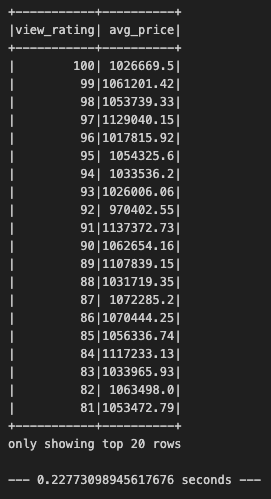
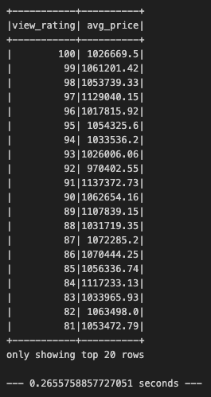

# Home_Sales

In this challenge, you'll use your knowledge of SparkSQL to determine key metrics about home sales data. Then you'll use Spark to create temporary views, partition the data, cache and uncache a temporary table, and verify that the table has been uncached.

1. Spark DataFrame

2. Answer the following questions using SparkSQL:

    1. What is the average price for a four-bedroom house sold for each year? Round off your answer to two decimal places.

    

    2. What is the average price of a home for each year the home was built, that has three bedrooms and three bathrooms? Round off your answer to two decimal places.

    

    3. What is the average price of a home for each year the home was built, that has three bedrooms, three bathrooms, two floors, and is greater than or equal to 2,000 square feet? Round off your answer to two decimal places.

    

    4. What is the average price of a home per "view" rating having an average home price greater than or equal to $350,000? Determine the run time for this query, and round off your answer to two decimal places.

    

3. Using the cached data, run query #4. Determine the runtime and compare it to uncached runtime.

4. Partition by the "date_built" field on the formatted parquet home sales data and run the query #4. Determine the runtime and compare it to uncached runtime.

